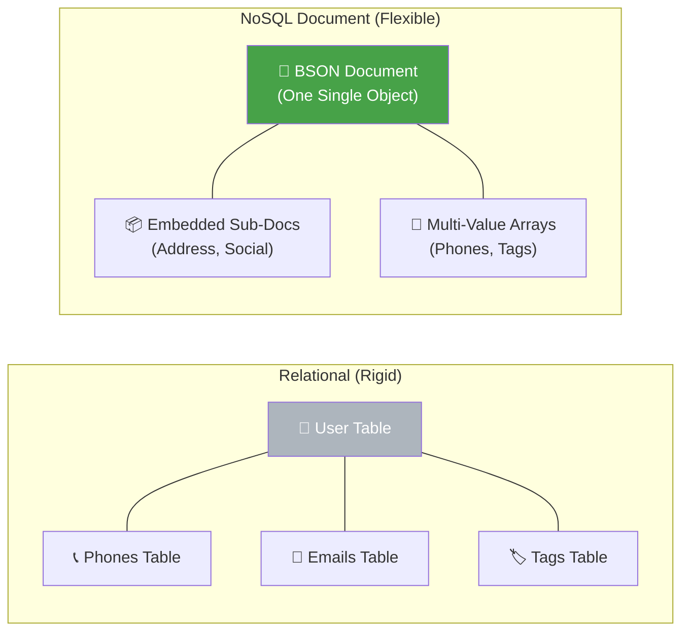
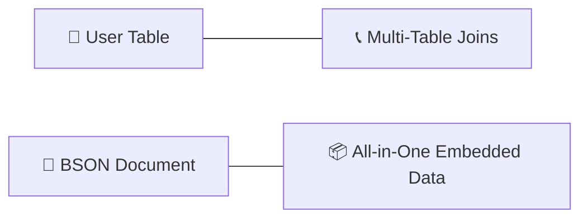

# 📇 DigitalConnect: Flexible NoSQL Document Modeling with MongoDB

<p align="center">
  
  
  
  
  
</p>

**DigitalConnect** è un'architettura di database NoSQL progettata per gestire dati eterogenei e in rapida evoluzione. Utilizzando **MongoDB**, il progetto dimostra la potenza del paradigma document-oriented nella modellazione di una rubrica contatti enterprise, dove la flessibilità dello schema permette di gestire attributi variabili, sub-documenti annidati e query analitiche complesse senza la rigidità dei vincoli relazionali.

## 🏢 Valore Enterprise & Settori di Applicazione

| Settore / Ambito | Rilevanza & Benefici |
|-------------------|-----------|
| **Agile App Development** | Accelerazione del time-to-market eliminando le costose migrazioni di schema SQL durante l'evoluzione delle feature. |
| **User Profile Management** | Gestione di profili utente con attributi dinamici e preferenze variabili, tipici di piattaforme Media, Telco ed E-commerce. |
| **Content Management Systems** | Archiviazione di asset informativi non strutturati o semi-strutturati con metadati estensibili on-the-fly. |
| **Microservices Architecture** | Supporto al pattern "Database per Service" con archivi leggeri, scalabili e indipendenti. |

---

## 🎯 Executive Summary & Valore di Business
DigitalConnect risolve il problema della "impedance mismatch" tra codice ad oggetti e database, offrendo una persistenza naturale e ad alte prestazioni.

### 🏛️ 1. Modellazione Documentale Avanzata
* **Embedding vs Referencing:** Strategia di denormalizzazione estrema tramite sub-documenti annidati (`Altri_contatti`), che permette il recupero dell'intero profilo utente con una singola operazione di I/O, azzerando la latenza tipica delle JOIN relazionali.
* **Polimorfismo dello Schema:** Gestione nativa di campi polimorfici (es. numeri di telefono che possono essere stringhe singole o array), permettendo al database di evolvere insieme alle esigenze di business senza downtime.

### ⚙️ 2. Querying e Aggregation Framework
* **Pattern Matching su Array:** Utilizzo di indici di array e operatori `$exists` per identificare segmenti specifici di contatti (es. utenti con più telefoni o privi di profili social).
* **Aggregation Pipeline:** Implementazione di workflow analitici multi-stadio (`$match`, `$group`, `$avg`) per estrarre insight comportamentali direttamente a livello di database, riducendo il trasferimento dati verso l'applicazione.

### 🛡️ 3. Operatività NoSQL
* **Bulk Ingestion:** Utilizzo di `mongoimport` per la gestione di caricamenti massivi di dati in formato JSON/BSON, dimostrando la scalabilità in fase di data seeding.
* **Atomic Updates:** Utilizzo degli operatori di aggiornamento atomico (`$push`, `$set`) per garantire la coerenza dei dati durante le modifiche concorrenti.

---

## 🏗️ Architettura del Documento vs Relazionale



## 🛠️ Stack Tecnologico

| Layer | Tecnologia | Ruolo |
|:------|:-----------|:-----|
| 🗄️ **Database** | MongoDB 6.x | Document-Oriented Store |
| 🐚 **Shell** | mongosh | Administrative Querying |
| 📊 **Processing** | Aggregation Pipeline | On-the-fly Data Transformation |
| 📂 **Data Format** | JSON / BSON | Native Document Serialization |

## 🚀 Setup & Querying

```bash
# Ingestione Dati
mongoimport --db Rubrica_Utenti --collection Rubrica --file contatti.json --jsonArray

# Analisi Esempio (Media chiamate Amici Stretti)
db.Rubrica.aggregate([
    { $match: { Amici_stretti: true } },
    { $group: { _id: null, media: { $avg: "$Chiamate_ultimo_mese" } } }
])
```

<br><br>

*Progettato e sviluppato da Eugenio Pasqua.*

---

# 🇬🇧 ENGLISH VERSION

# 📇 DigitalConnect: Flexible NoSQL Document Modeling with MongoDB

<p align="center">
  
  
</p>

**DigitalConnect** is a NoSQL database architecture designed to handle heterogeneous and rapidly evolving data. Using **MongoDB**, the project demonstrates the power of the document-oriented paradigm in modeling an enterprise contact directory, where schema flexibility allows for variable attributes, nested sub-documents, and complex analytical queries without relational constraints.

## 🏢 Enterprise Value & Application Sectors

| Sector / Domain | Relevance & Benefits |
|-------------------|-----------|
| **Agile Apps** | Faster time-to-market by eliminating costly SQL schema migrations. |
| **User Profiling** | Managing dynamic user profiles and variable preferences for Media and Telco platforms. |
| **Microservices** | Supporting the "Database per Service" pattern with lightweight, scalable, and independent stores. |

---

## 🏗️ Document vs Relational Architecture



## 🧰 Technology Stack

`MongoDB 6.x` · `mongosh` · `mongoimport` · `Aggregation Pipeline` · `Document Modelling`

<br><br>

*Designed and developed by Eugenio Pasqua.*
